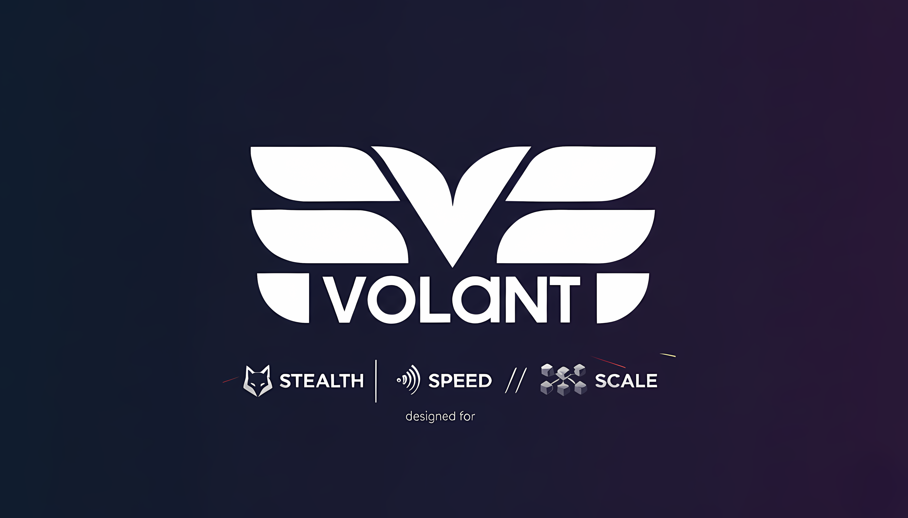

<p align="center">
  
</p>

<p align="center">
  <a href="https://github.com/ccheshirecat/volant/actions">
    
  </a>
  <a href="https://github.com/ccheshirecat/volant/releases">
    
  </a>
  <a href="https://golang.org/">
    
  </a>
  <a href="https://github.com/ccheshirecat/volant/blob/main/LICENSE">
    
  </a>
</p>

---

# Volant

> **The modular microVM orchestration engine.**

Volant turns microVMs into a first-class runtime surface. The project ships a control plane, CLI/TUI, and agent that speak a common plugin manifest so teams can run secure, stateful workloads without stitching together networking, scheduling, and lifecycle plumbing themselves.

Runtime-specific behavior lives in signed manifests and their associated artifacts. The core engine stays lean while plugin authors ship the kernels/initramfs overlays and workload processes their runtime requires. Operators decide which manifests to install and must reference one whenever a VM is created.

---

## Overview

- **Control plane (`volantd`)** manages SQLite-backed state, static IP leasing, orchestration, REST/MCP/AG-UI APIs, and the plugin registry.
- **Agent (`volary`)** boots inside each microVM, hydrates the declared runtime, and mounts plugin-defined HTTP/WebSocket routes.
- **CLI & TUI (`volar`)** provide a dual-mode operator experience: scriptable Cobra commands and a Bubble Tea dashboard.
- **Plugins** declare resources, workloads, and optional OpenAPI/action metadata via manifests—letting browser automation, AI inference, worker pools, or custom stacks share the same engine.

---

## Highlights

- 🛡 **Hardware isolation first** – every workload runs inside a Cloud Hypervisor microVM with static network bridging.
- 🧩 **Plugin contract** – manifests capture runtime requirements, workload entrypoints, and optional OpenAPI metadata.
- 🔌 **Universal proxy** – the control plane can forward REST, SSE, or WebSocket traffic to runtime agents without exposing private IPs.
- 📡 **AI-native APIs** – REST, Model Context Protocol, and AG-UI event streams ship in the box.
- 🧰 **Operator ergonomics** – one binary installs networking, bootstraps the database, and exposes both CLI and TUI surfaces.

---

## Quick start

```bash
# Install the Volant toolchain (binaries, kernel, initramfs)
curl -sSL https://install.volant.cloud | bash

# Configure the host (bridge networking, NAT, systemd service)
sudo volar setup

# Install a plugin manifest (Steel browser)
volar plugins install --manifest ./manifests/steel-browser.json

# Create a microVM referencing that plugin
volar vms create demo --plugin steel-browser --cpu 2 --memory 2048

# Discover workload endpoints
volar plugins manifest steel-browser --summary
```

Refer to `docs/guides/plugins.md` for manifest structure, validation, and distribution workflows.

---

## Architecture at a glance

| Layer | Responsibility |
| ----- | -------------- |
| Control plane | Persist state (SQLite), lease IPs, spawn microVMs, proxy agent traffic, emit events |
| Agent | Boot runtime, expose plugin routes, stream logs, surface DevTools info when available |
| Plugins | Provide kernels/initramfs overlays, declare resources/actions, publish OpenAPI metadata |
| Tooling | `volar` CLI/TUI + REST/MCP clients consuming the same manifests |

---

## Plugin workflow

1. **Author** a manifest (`schema_version`, `name`, `version`, `runtime` optional, `rootfs`, resource envelope, workload contract, optional OpenAPI metadata).
2. **Package** the runtime artifacts referenced by the manifest (kernel/initramfs, OCI image, minisign signatures, etc.).
3. **Install** the manifest with `volar plugins install --manifest path/to/manifest.json`; the control plane validates and persists it.
4. **Enable/disable** with `volar plugins enable <name>` or `volar plugins disable <name>`.
5. **Launch VMs** by referencing the plugin: `volar vms create <vm> --plugin <name>`. Runtime metadata and the manifest payload are injected into the VM at boot.
6. **Interact with the workload** by using the endpoints described in the manifest/OpenAPI document. Legacy `/api/v1/plugins/.../actions/...` proxies remain for older manifests but new plugins should expose standard HTTP or WebSocket surfaces.

The engine persists manifests, enforces enablement state, and resolves action routing so microVMs only run compatible runtimes.

---

## Repository layout

```
cmd/               # Entry points (volantd, volar, volary)
internal/          # Control plane, agent runtime, CLI/TUI, protocols
  agent/
  cli/
  protocol/
  server/
  setup/
build/             # Kernel/initramfs tooling
docs/              # Product documentation
Makefile           # Build + setup automation
go.mod / go.sum
```

---

## Development

1. Install **Go 1.22+** and Docker.
2. Build binaries: `make build` (or `make volantd volar volary`).
3. Build artifacts (kernel/initramfs): `make build-images`.
4. Run integration SQLite migrations: `make migrate`.
5. Launch the control plane locally:
   ```bash
   ./bin/volantd --config ./configs/dev.yaml
   ./bin/volar vms list
   ```

See `docs/guides/development.md` for deeper instructions.

---

## Documentation

The latest guides live in [`docs/`](docs) and at [docs.volant.cloud](https://docs.volant.cloud) once published.

Key entry points:
- [Start here](docs/start/introduction.md)
- [Plugin authoring](docs/guides/plugins.md)
- [REST API](docs/api/rest-api.md)
- [MCP interface](docs/api/mcp.md)

---

## Contributing

Pull requests, issues, and plugin proposals are welcome. Please see `CONTRIBUTING.md` (coming soon) for workflow details.

---

## License

Apache 2.0 – see [LICENSE](LICENSE).

---

<p align="center"><i>Volant — Build the runtime you need, without rebuilding the control plane.</i></p>
