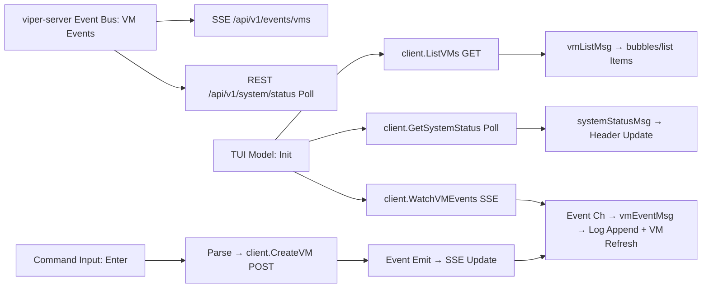

# Architecture Overview

## System Components
- **viper-server**: Native orchestrator responsible for lifecycle management of Cloud Hypervisor microVMs, static IP allocation, and API exposure (REST, MCP, AG-UI).
- **viper-agent**: In-VM Go service that proxies browser automation commands to a headless Chrome (chromedp/headless-shell) instance, exposes CDP forwarding, and persists artifacts.
- **VM Image Pipeline**: Docker → initramfs build that assembles the Chrome runtime, custom `/bin/viper-init`, and agent binary into bootable artifacts.
- **Client Tooling**: Dual-mode `viper` CLI (Cobra) and interactive Bubble Tea TUI providing human and automation entry points.

## Control Flow Summary
1. **VM Creation**
   - REST/MCP request hits `viper-server`.
   - Server begins SQLite transaction, leases deterministic IP, and persists VM metadata.
   - Engine launches Cloud Hypervisor process with kernel/initramfs and static IP embedded in kernel cmdline.
   - Event bus broadcasts VM lifecycle event for TUI, AG-UI, and other subscribers.

2. **In-VM Boot**
   - Kernel executes `/bin/viper-init` which mounts virtual filesystems, parses `ip=` from `/proc/cmdline`, configures `eth0`, and `exec`s `viper-agent`.
   - Agent launches headless Chrome, exposes REST+CDP endpoints.

3. **Task Execution**
   - CLI/TUI/MCP actions proxy through `viper-server` to the agent (`/v1/vms/{name}/agent`).
   - Results, logs, and artifacts stream back through the proxy and event bus.

4. **Teardown**
   - Destroy request terminates Cloud Hypervisor process, updates state, and releases IP within the same SQLite transaction.

## Persistence
- Embedded SQLite at `$HOME/.viper/state.db` managed via the in-process `sqlite` store (`internal/server/db/sqlite`) using the CGO-backed `github.com/mattn/go-sqlite3` driver.
- Go-embedded migrations execute sequentially at boot, recording state in `schema_migrations` for deterministic upgrades.
- Typed repositories provide CRUD and lifecycle helpers:
  - `VirtualMachines()` handles creation, runtime status updates (PID/status), kernel cmdline updates, and deletion.
  - `IPAllocations()` manages pool seeding (`EnsurePool`), deterministic leasing, VM assignment, and release semantics.
- Core tables:
  - `vms(id, name, status, pid, ip_address, cpu_cores, memory_mb, created_at, updated_at)`
  - `ip_allocations(ip_address PRIMARY KEY, vm_id NULLABLE, status, leased_at)`
  - `workloads(... TBD ...)`
  - `plugins(... TBD ...)`
- `Store.WithTx` coordinates transactional workflows so IP leases and VM lifecycle mutations commit atomically.

## Orchestrator Engine (Current State)
- `internal/server/orchestrator` exposes a production engine constructor with dependency injection for `db.Store`, logging, and subnet metadata.
- `Engine.Start` seeds the IP pool via `EnsurePool`, guaranteeing availability before servicing requests.
- `CreateVM` performs validation, leases the next available static IP, assigns a deterministic MAC (stable hash of name+IP), persists metadata, and delegates to the runtime launcher to boot the VM. A background monitor watches the hypervisor process and marks the VM `stopped`/`crashed` while cleaning up taps and sockets.
- `DestroyVM` tears down VM metadata and releases the associated IP in the same transaction.
- Public queries (`ListVMs`, `GetVM`) surface persisted state ahead of REST exposure.
- A pluggable runtime layer (`internal/server/orchestrator/runtime`) defines the launch contract; the initial `cloudhypervisor.Launcher` assembles the `cloud-hypervisor` command, manages API sockets/logs, and exposes graceful shutdown hooks.
- Lifecycle changes emit structured events on `eventbus.Bus` (`internal/server/orchestrator/events`), enabling REST/MCP/AG-UI layers to stream `VM_CREATED`, `VM_RUNNING`, `VM_STOPPED`, and `VM_CRASHED` notifications.

## Networking Model
- Host bridge `viperbr0` at `192.168.127.1/24` created by `viper setup`.
- NAT enabled via `iptables` MASQUERADE to allow outbound access.
- MicroVMs receive static IP via kernel cmdline to avoid DHCP complexity.
- MAC addresses generated per VM with deterministic prefix to simplify filtering.
- `network.BridgeManager` provisions tap interfaces via `ip tuntap`/`ip link`, attaches them to the bridge, and tears them down during VM destruction. A `NoopManager` remains available for non-Linux development hosts.

## API Layer
- `internal/server/httpapi` uses Gin to expose REST endpoints at `/api/v1`:
  - `GET /api/v1/vms` lists orchestrated microVMs.
  - `POST /api/v1/vms` creates a VM (CPU/memory/cmdline payload).
  - `GET /api/v1/vms/:name` retrieves a single VM.
  - `DELETE /api/v1/vms/:name` destroys a VM and releases its resources.
  - `GET /api/v1/system/status` returns system metrics (VM count, CPU/MEM placeholders).
- `GET /api/v1/events/vms` streams lifecycle events over Server-Sent Events (SSE) sourced from the internal event bus.
- Request/response payloads are JSON; future work will introduce authn/z, pagination, and richer error semantics.

## Eventing & Protocols
- Internal event bus fan-outs lifecycle events to:
  - REST SSE/WebSocket endpoints for TUI.
  - AG-UI WebSocket emitter translating internal events into protocol schema.
  - MCP handler for AI orchestration.
- Future work: durable event log for replay/audit.

## TUI Architecture
The interactive TUI (`internal/cli/tui`) is built with Bubble Tea and its ecosystem (bubbles, lipgloss) for a multi-pane "God Mode" dashboard. It maintains a stateful connection to the viper-server via the client package for REST and SSE.

### Layout and Components
- **Header Pane**: Polls `/api/v1/system/status` every 5s for live metrics (VM count, CPU/MEM %). Styled with lipgloss for status bar.
- **VM List Pane**: Uses `bubbles/list` for selectable VM items (name, status, IP, CPU/MEM). Initial data from `GET /api/v1/vms`; updates on SSE events via `WatchVMEvents`.
- **Log Viewer Pane**: `bubbles/viewport` for scrolling real-time logs from SSE events (timestamp, type, message). Appends new lines, limits to 100.
- **Command Input Pane**: `bubbles/textinput` for command entry (e.g., "vms create my-vm"). Supports tab to switch panes, enter to execute (parses to REST calls like CreateVM), history placeholder.

### Data Flow
- **Initialization**: Fetches VMs and status, starts SSE stream, tick for polling.
- **Updates**: SSE events trigger VM refresh and log append; tick refreshes status/VMs.
- **Interaction**: Key bindings (tab/enter/up/down/q) for navigation/execution. Commands proxy to REST (e.g., create VM emits event for live update).
- **Error Handling**: Displays errors in view; stream closure noted.

### TUI Data Flow Diagram

## Security & Observability (Preview)
- Authn/z layer to be defined (API tokens or mutual TLS) before release.
- Structured logging via `log/slog`; metrics/exporters to be added (Prometheus/OpenTelemetry).
- Agent-server communication constrained to private subnet; host firewall rules enforced by installer.

## Open Questions
- Migration tooling selection (golang-migrate vs. sqlc w/ migrations?).
- Artifact distribution strategy for kernel/initramfs (local cache vs. remote registry).
- Secret management for profile injection (encryption at rest, retrieval flows).

This document evolves alongside implementation milestones; keep it updated as contracts solidify.