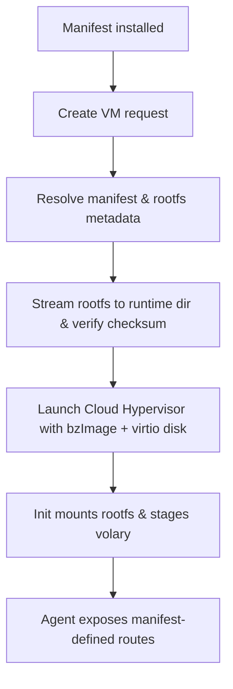

# Image Pipeline

Volant ships a single kernel artifact (bzImage) that already contains our initramfs and the `volary` agent. The orchestrator no longer expects plugins to bring their own kernel or initrd — plugins only supply a root filesystem bundle and the HTTP surface they want to expose. This document walks through the artifacts we produce, how the host hydrates plugin images, and what the in-VM bootstrap does with them.

## Artifact Layout
- `kernels/<arch>/bzImage` — Cloud Hypervisor compatible kernel with embedded initramfs committed to the repository for downloads (per release tag). The default runtime path used by the daemon is `kernel/bzImage` relative to the systemd WorkingDirectory. With WorkingDirectory=/var/lib/volant, that resolves to `/var/lib/volant/kernel/bzImage`.
- `checksums.txt` — SHA256 digests for release validation.

Releases publish the `kernels/<arch>/bzImage` path so the installer can fetch it. Local rebuilds are supported via `build/bake.sh` which produces only the initramfs; you must integrate it into the Linux kernel using `CONFIG_INITRAMFS_SOURCE` on the Cloud Hypervisor kernel fork.

## Host Boot Flow
1. **Manifest install** – When a plugin manifest is registered, it is persisted and cached by the engine (`internal/server/plugins/registry.go`). The manifest declares a `rootfs` URL, checksum, resource envelope, and action map.
2. **Create VM** – On `createVM`, the orchestrator resolves the manifest and assembles a `LaunchSpec` (`internal/server/orchestrator/orchestrator.go:241`). Core kernel args always include the IP lease and the identifiers `volant.runtime`, `volant.plugin`, `volant.api_host`, and `volant.api_port` so the agent can crawl back to the control plane.
3. **Rootfs hydration** – `cloudhypervisor.Launcher` streams the declared `rootfs.url` into the runtime directory before boot (`internal/server/orchestrator/cloudhypervisor/launcher.go:76`). HTTP(S), `file://`, and absolute paths are supported. If `rootfs.checksum` is present, it is verified as a `sha256` (with or without the `sha256:` prefix).
4. **Launching Cloud Hypervisor** – The launcher stages a per-VM copy of the bzImage and attaches the fetched rootfs as a writable virtio disk. No separate `--initramfs` flag is required because the initramfs is baked into the kernel.
5. **In-VM init** – Our tiny C init (`build/init.c`) configures the console, brings up `/dev`, `/proc`, `/sys`, and `/run`, and then hydrates the runtime. If a rootfs image was declared it is mounted (loopback or squashfs depending on the build), `stage-volary.sh` copies the agent into `/usr/local/bin`, and control pivots into the plugin filesystem via `switch_root`. Should mounting fail, the initramfs copy of `volary` is used as a safe fallback.
6. **Agent startup** – `volary` reads the kernel command line, fetches the manifest over HTTP, and starts the runtime-specific router (`internal/agent/app/app.go:170-420`). The registered actions are exposed under `/api/v1/plugins/{plugin}/actions/{action}` and must correspond to OpenAPI metadata advertised by the manifest.



## Manifest Responsibilities
Plugin authors now focus on their runtime filesystem and HTTP contract. A minimal manifest looks like:

```json
{
  "schema_version": "2024-09",
  "name": "browser",
  "version": "2.0.0",
  "runtime": "browser",
  "resources": { "cpu_cores": 2, "memory_mb": 2048 },
  "rootfs": {
    "url": "https://artifacts.example.com/browser/rootfs.squashfs",
    "checksum": "sha256:2d4f41..."
  },
  "workload": {
    "type": "http",
    "base_url": "http://127.0.0.1:8080"
  },
  "actions": {
    "navigate": {
      "description": "Navigate to URL",
      "method": "POST",
      "path": "/v1/browser/navigate",
      "timeout_ms": 60000
    }
  },
  "openapi": "https://artifacts.example.com/browser/openapi.json",
  "labels": { "tier": "reference" }
}
```

- `rootfs.url` accepts HTTP(S), `file://`, or absolute host paths. Leaving it blank boots straight into the initramfs, which is useful for debugging but not for production runtimes.
- `rootfs.checksum` is optional but recommended. Provide a bare SHA256 or prefix it with `sha256:`.
- `actions` must point at real HTTP endpoints inside the VM. The control plane proxies requests verbatim, so the manifest’s OpenAPI document should describe the same surface.

## Rootfs Expectations
- Include the binaries, assets, and services your runtime needs. At minimum, provide the HTTP routes declared in the manifest.
- Placing `volary` in the image is optional; `stage-volary.sh` copies the embedded agent into `/usr/local/bin` before the switch_root happens.
- Network is preconfigured by the kernel parameters, so services can bind to `0.0.0.0` or `127.0.0.1` immediately.
- SquashFS images work well for read-only runtimes, but writable formats (ext4 raw disks) are also supported because the disk is attached as a standard virtio-blk device.

## Building Rootfs Images
The Volant repo does not bundle a generic rootfs build system, but the companion [`fsify`](https://github.com/ccheshirecat/fsify) tool converts OCI/Docker images into bootable filesystem artifacts (squashfs, ext4, raw disks). A typical workflow is:

```bash
# Convert an OCI image to a squashfs rootfs and publish it
fsify convert oci://ghcr.io/acme/browser:2.0 --format squashfs --output ./rootfs.squashfs
sha256sum ./rootfs.squashfs
```

Upload the resulting artifact to your distribution channel, record the SHA256 in the manifest, and the engine takes care of staging it for each VM.

## Troubleshooting
- **Rootfs fetch failures** – Verify the URL is reachable from the host and the checksum matches. Errors are surfaced from `cloudhypervisor.Launcher` before boot.
- **Manifest fetch failures inside the VM** – Ensure `volant.api_host`, `volant.api_port`, and `volant.plugin` were set. The control plane automatically injects them, but custom kernel flags can accidentally shadow them.
- **Agent fallback** – If your image does not contain `volary`, the initramfs copy will run instead. Check the serial log (`~/.volant/logs/<vm>.log`) for mount errors.
