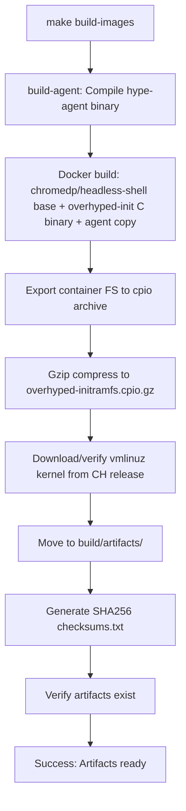

# Image Pipeline

The image build flow produces two artifacts consumed by the orchestrator:

- `vmlinuz-x86_64` – downloaded from the Cloud Hypervisor kernel release (default URL baked into the script).
- `overhyped-initramfs.cpio.gz` – initramfs containing Chrome headless + `hype-agent` and the custom C init.

## Requirements
- Docker (tested with Docker Desktop on macOS/Linux).
- `hype-agent` binary built at `bin/hype-agent` (handled automatically via Makefile).
- For GHCR pulls (chromedp/headless-shell): If you encounter 403 Forbidden, run `docker login ghcr.io` with a GitHub personal access token (read:packages scope for anonymous rate limits).

## Top-Level Makefile Integration
The build is now fully integrated into the top-level `Makefile` via the `build-images` target. This provides a reproducible, single-command workflow with dependency management, artifact verification, and checksum generation.

### Steps
1. Run the integrated build:
   ```
   make build-images
   ```
2. This target:
   - Builds the `hype-agent` binary (dependency on `build-agent`).
   - Creates `build/artifacts/` directory if needed.
   - Executes `./build/images/build-initramfs.sh bin/hype-agent` (passes agent path).
   - Moves outputs (`overhyped-initramfs.cpio.gz`, `vmlinuz-x86_64`) to `build/artifacts/`.
   - Generates `checksums.txt` with SHA256 sums in the artifacts dir.
   - Verifies files exist (fails build if missing).
3. Artifacts are ready in `build/artifacts/` for orchestrator consumption.

### Build Workflow Diagram


## Script Details
The underlying `./build/images/build-initramfs.sh` script:
- Builds the Docker context under `build/images/` which compiles a statically linked `/sbin/overhyped-init` (C) and copies `hype-agent` into the Chromedp headless-shell base image.
- Exports the container filesystem and packages it into a gzip-compressed `cpio` archive suitable for use as an initramfs.
- Downloads the default Cloud Hypervisor kernel (`vmlinuz-x86_64`) if not already present.

## Customization
- Override environment variables:
  - `IMAGE_TAG` – Docker image tag used for intermediate build.
  - `INITRAMFS_NAME` – output filename for the initramfs.
  - `KERNEL_URL` – alternate kernel download URL.
- Provide a custom agent path as the first argument to the script (handled by Makefile).

## Troubleshooting
- **Docker GHCR 403 Forbidden**: Public images on GitHub Container Registry require authentication for higher rate limits. Create a GitHub PAT (classic, with `read:packages`), then `docker login ghcr.io -u USERNAME -p PAT`.
- **No Docker**: The script requires Docker; consider alternatives like Podman for rootless builds in future.
- **Agent Build Fails**: Ensure Go modules are tidy (`make tidy`) and dependencies are met.

## Future Work
- Support arm64 kernels and multi-arch builds.