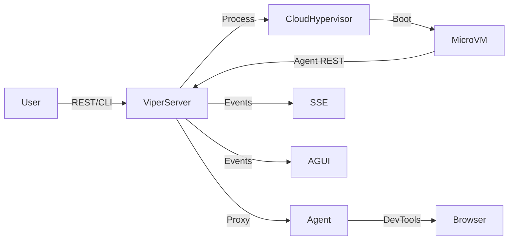

# Architecture

## Components

- **viper-server**: Go-based orchestrator
  - REST API (`/api/v1`) and event streaming (SSE, WS)
  - MCP and AG-UI bridges
  - SQL persistence (`~/.viper/state.db`)
  - Cloud Hypervisor process supervision
- **viper-agent**: Go HTTP service inside each microVM
  - Hosts headless Chrome (chromedp/headless-shell)
  - Exposes REST endpoints (`/v1/navigation`, `/v1/dom`, `/v1/profile`, `/v1/logs/stream`)
  - Provides DevTools WebSocket metadata and proxying
- **Image pipeline**: `build/images/`
  - Stages agent binary into Alpine build container
  - Compiles static `viper-init`
  - Produces `viper-initramfs.cpio.gz` / `vmlinux-x86_64`
- **CLI/TUI** (`viper`)
  - Cobra commands for scripting
  - Bubble Tea TUI for operators (`vms`, log stream, command palette)

## Data Flow

### VM Lifecycle

1. `POST /api/v1/vms` or CLI `viper vms create`
2. Server leases IP (SQLite `ip_allocations`), generates MAC
3. Launch `cloud-hypervisor --cmdline "ip=..."`
4. `viper-init` configures `eth0` and execs agent
5. Agent announces DevTools metadata; server logs running status
6. Destroy path tears down process, releases IP, cleans up taps/sockets

### Networking

- Bridge `viperbr0` at `192.168.127.1/24`
- Static IP via kernel cmdline (`ip=a.b.c.d::gateway:mask:hostname:eth0:off`)
- NAT via `iptables -t nat POSTROUTING MASQUERADE`
- Deterministic MAC addresses (prefix `0a:58:...`)

## Persistence Schema

Tables (simplified):

| Table | Columns |
| --- | --- |
| `vms` | `id`, `name`, `status`, `pid`, `ip_address`, `cpu_cores`, `memory_mb`, `kernel_cmdline`, timestamps |
| `ip_allocations` | `ip_address` (PK), `status`, `vm_id`, `leased_at` |
| `plugins` | (planned) |
| `workloads` | (planned) |

Transactions ensure IP lease + VM metadata stay consistent.

## Event Bus

- `internal/server/eventbus`
- Publishes `orchestratorevents.VMEvent`
- Consumers: SSE, AG-UI WebSocket, TUI log pane

## CLI/TUI Highlights

- REST client in `internal/cli/client`
- Commands: `vms list`, `vms create`, `setup`, `browsers proxy`
- TUI features: VM list, live logs, command history, autocomplete, DevTools proxy status

## Release Artifacts

- Binaries: `viper`, `viper-server`, `viper-agent`
- Kernel/initramfs: `build/artifacts/`
- Installer: `scripts/install.sh`

For deeper dives, see `docs/image-pipeline.md`, `docs/api/rest.md`, and `docs/protocols/`.
